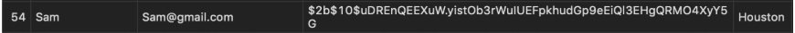
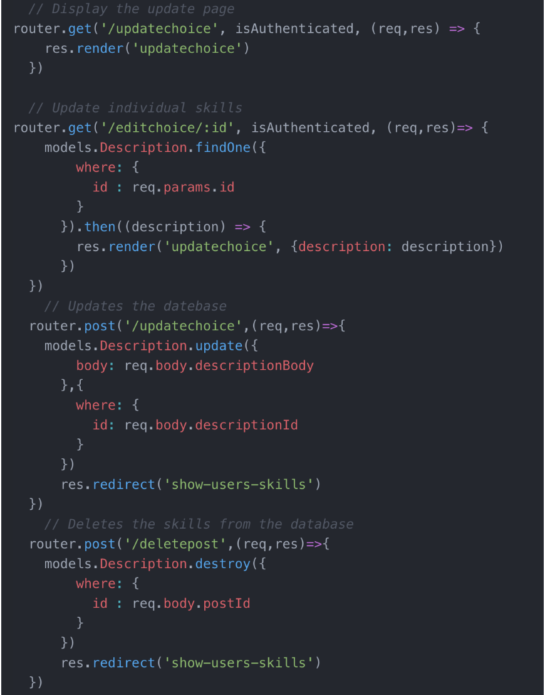

# Skill-Exchange

**Purpose:** The purpose of the Skill Exchange website is to provide our users with a non monetary based economy where they can trade skills/lessons with other users. 

**How to use:** When users land on our website they have the option to register or log in. If this is your first time visiting Skill Exchange you'll need to register with a valid email address (so other users can contact you). Once registered, the user is able to login where they are then redirected to the home page where they can add a skill to teach. They can select skills from a variety of categories and add a description about their specific skill and duration of time which they are available to teach it. After entering their first skill the user can either enter another skill or go to the User Profile page to see all of the skills they are currently offering for trade. On the user profile page they can update or delete their submissions. When users are ready to make a trade with another user, they should navigate to the Trade page. The Trade page allows users to view and select from a variety of categories in which they would like to learn a new skill. Once a category is selected, multiple listings of lessons offered by other users in that category are displayed along with an email button. A user can then select the email button which will populate a prefilled email to the user offering that specific skill in order to request an exchange!

**Features:** node.JS, Mustache-Express, HTML, CSS, Bootstrap, Sequelize, Express, Express-sessions, ElephantSQL, Heroku

**Live Link:** https://skills-exchange.herokuapp.com/

**Project Contributors:** Ashley Mello, Bannon Smith, Lina Jimenez

If you want to use the site without going through the registration you can use the username and password below:
**Username: guest@gmail.com
**Password: password

 

We made sure to encrypt User passwords in our Database using bcrypt:

Our team thought it would be a good idea to take advantage of express routes in order to keep our code organized. This code snippet shows how users update and delete their posts after they've been created:

This is a video of an user adding skills to there account.

